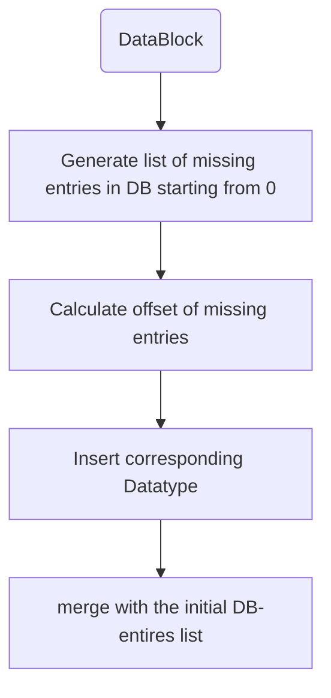

# iX Developer Tag Export Siemens S7 DataBlock Generator

```mermaid
flowchart TD
    DB(DataBlock) --> CheckDB[Generate list of missing entries in DB starting from 0]

    CheckDB --> Calc[Calculate offset of missing entries]

    Calc --> Insert[Insert corresponding Datatype]

    Insert --> Merge[merge with the initial DB-entires list]
```
